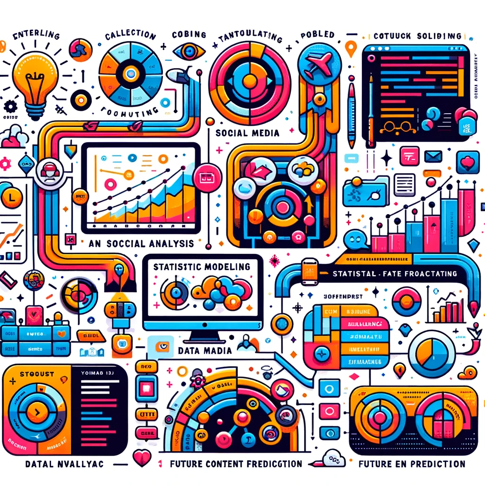

# Social Media Analysis and Forecasting Project

## Overview
This project leverages the power of data analysis and machine learning to provide insights into social media content performance and forecast future trends. By analyzing historical data from Instagram profiles, we can predict the potential engagement levels of future posts, aiding in strategic planning and optimization.

## Process
1. **Data Collection**: Utilize `instaloader` to scrape historical data from specified Instagram profiles.
2. **Data Preprocessing**: Clean and structure the data for analysis.
3. **Exploratory Data Analysis (EDA)**: Visualize and understand the trends, patterns, and anomalies within the data.
4. **Model Training**: Employ statistical and machine learning models to understand the relationships between different factors influencing post engagement.
5. **Forecasting and Prediction**: Predict future engagement levels based on insights drawn from the data.

## Problems Solved
- **Content Strategy Optimization**: Identifying the best times to post, types of content that gain the most engagement, and trends among the audience.
- **Engagement Prediction**: Forecasting likes, comments, and overall reach of future posts.
- **Trend Analysis**: Understanding long-term trends in engagement and audience growth.

## How It Works

The diagram above visually represents the workflow and processes involved in social media analysis and forecasting. Starting from data collection through to prediction, it outlines the steps taken to analyze and forecast social media content performance.

## Getting Started
Follow the instructions in the Jupyter Notebook to set up your environment, download data, and start analyzing and forecasting social media content performance.

## Contributing
Contributions are welcome! Please feel free to submit pull requests, suggest features, or report bugs.

## License
This project is licensed under the MIT License - see the LICENSE.md file for details.